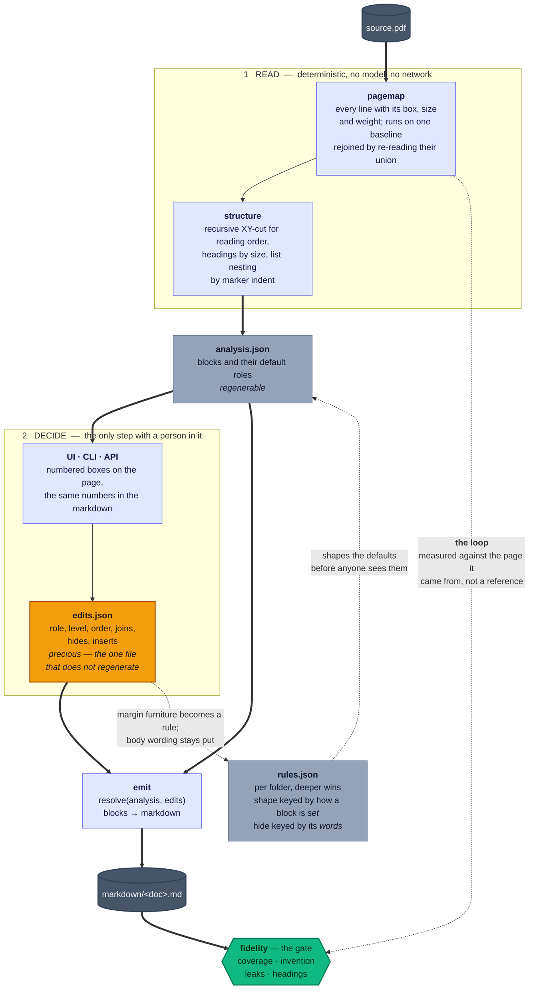

# mdgest

**PDF to Markdown, page by page, with a person in the loop and a gate on the way out.**

Markdown is what an LLM agent can actually ground on: cheap to put in a prompt,
cheap to chunk, cheap to cite. Getting there from a PDF is the part everyone
does badly, because a converter that guesses wrong has no way to tell you.

mdgest works completely offline, has a UI and a CLI that do the same things, and
gets better at your documents the more of them you convert.

## How it works

Every other converter is a one-way pipe: PDF in, markdown out, and no way to
ask whether the markdown is right. mdgest is a loop. The words come off the
page and nowhere else, a person supplies the shape, and the output is measured
back against **the same page map it was read from** — never against a
hand-made reference copy, because a reference is itself unverified.



Two things the picture is trying to make unmissable:

- **Only one file is precious.** `edits.json` holds what a person decided and
  nothing else does. `analysis.json`, the page renders and the markdown all
  regenerate from the PDF, so losing them costs time and never costs a
  decision.
- **Nothing invents.** A block's text is read off the page and is not
  writable, so the only words that can reach the markdown another way are the
  ones a person typed — and those arrive labeled. A word in the output that
  is on no page and in no insert is a bug in mdgest, which is precisely what
  the gate reports.

## Status

Being built up here one reviewable piece at a time. A working implementation
exists on the `spike/tauri` branch — a Python engine over pypdfium2 with a
FastAPI and typer face, a React UI, and a Tauri shell that carries the engine
as a packaged binary — and it is being carried across rather than merged, so
every part gets read again on the way in.

What is here so far:

| | |
|---|---|
| `engine/tests/fixtures/` | a synthetic two-document corpus, generated and reproducible |
| `engine/tests/golden/` | the markdown those fixtures must produce |
| `scripts/` | the checks CI runs, and a benchmark at real corpus scale |

## Building on it

```bash
curl -fsSL https://astral.sh/uv/install.sh | bash   # the engine needs uv
make setup
make check                                          # tests, ruff, and the conventions
```

Conventions, and the reasoning behind them: [CONTRIBUTING.md](CONTRIBUTING.md).

## License

MIT. See [LICENSE](LICENSE).
