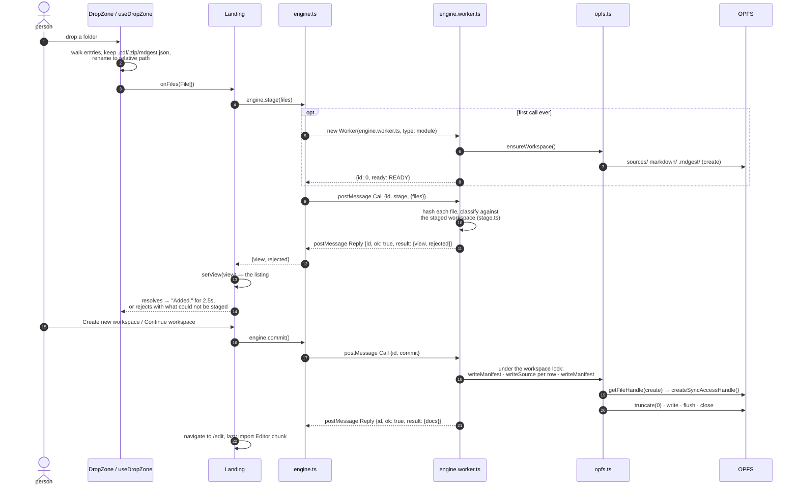

# Deployment

How the app gets from a commit to a visitor's browser, and where everything
runs once it is there. There is no server: the build is static files, and the
only process boundary the app has is between the page and its worker.

```mermaid
flowchart TB
    subgraph REPO ["1 &nbsp; SOURCE &nbsp;&mdash;&nbsp; git, one app at the repo root"]
        direction TB
        SRC["<b>src/</b><br/>main.tsx &middot; routes/ &middot; components/<br/>lib/ engine.ts &middot; protocol.ts<br/>engine.worker.ts &middot; opfs.ts &middot; workspace.ts"]
        PUB["<b>public/</b><br/>mark.svg &middot; icons.svg<br/><b>_redirects</b> &nbsp; <code>/* /index.html 200</code>"]
        CFG["vite.config.ts &middot; tsconfig.*.json<br/>.oxlintrc.json &middot; package.json &middot; bun.lock"]
    end

    subgraph CI ["2 &nbsp; GATE &nbsp;&mdash;&nbsp; GitHub Actions, .github/workflows/web.yml"]
        direction LR
        I["bun install<br/>--frozen-lockfile"] --> L["oxlint"] --> T["tsc -b"] --> B["vite build<br/>(rolldown)"]
    end

    subgraph DIST ["3 &nbsp; ARTIFACT &nbsp;&mdash;&nbsp; dist/, static files only"]
        direction TB
        HTML["index.html"]
        MAIN["assets/index-*.js<br/>react &middot; react-router<br/>Landing &middot; engine client"]
        EDIT["assets/Editor-*.js<br/>lazy route chunk"]
        WORK["assets/engine.worker-*.js<br/>module worker chunk<br/>opfs.ts lives here"]
        CSS["assets/index-*.css<br/>+ self-hosted fonts"]
        RED["_redirects"]
    end

    CF[("4 &nbsp; <b>Cloudflare Pages</b><br/>serves dist/ from the edge<br/>every path &rarr; index.html, status 200")]

    subgraph BROWSER ["5 &nbsp; RUNTIME &nbsp;&mdash;&nbsp; the visitor's browser, one origin, nothing leaves it"]
        direction TB
        subgraph MAINT ["main thread &mdash; paints, never touches storage"]
            direction TB
            RT["<b>BrowserRouter</b> &nbsp;<i>index-*.js</i><br/><code>/</code> &rarr; Landing<br/><code>/edit/*</code> &rarr; Editor, <i>Editor-*.js</i> on first visit<br/>splat, because an id has slashes"]
            LAND["<b>Landing &middot; DropZone &middot; useDropZone</b><br/>walks a dropped folder, keeps .pdf and .zip,<br/>renames each File to its relative path"]
            ENG["<b>engine.ts</b> &mdash; the client<br/>new Worker(&hellip;, {type: module}) lazily, on first call<br/>waits for READY, then id-sequenced calls<br/>pending Map&lt;id, resolve/reject&gt;"]
            RT --> LAND
            LAND -->|"onFiles(File[])"| ENG
        end

        subgraph WT ["engine worker &mdash; engine.worker-*.js, type: module"]
            direction TB
            DISP["<b>dispatch table</b> exhaustive over Engine<br/>stage &middot; unstage &middot; keep &middot; discardWorkspace<br/>stageView &middot; commit &mdash; see protocol.ts"]
            OPFS["<b>opfs.ts</b><br/>navigator.storage.getDirectory()<br/>getDirectoryHandle / getFileHandle &mdash; async<br/>createSyncAccessHandle() &mdash; sync read/write<br/>truncate(0) &rarr; write &rarr; flush &rarr; close"]
            DISP --> OPFS
        end

        subgraph STORE ["OPFS &mdash; origin private file system, evictable"]
            direction TB
            S1["sources/&lt;folder&hellip;&gt;/&lt;doc&gt;.pdf<br/><i>the only thing that cannot be recomputed</i>"]
            S2["markdown/&lt;folder&hellip;&gt;/&lt;doc&gt;.md"]
            S3[".mdgest/&lt;folder&hellip;&gt;/&lt;doc&gt;.pdf/<br/>analysis.json &middot; <b>edits.json</b> &middot; versions.json<br/>.mdgest/&lt;folder&hellip;&gt;/rules.json"]
        end

        ENG <==>|"postMessage<br/>Call {id, method, params}<br/>Reply {id, ok, result | error}"| DISP
        OPFS ==> STORE
    end

    EXPORT[("export folder on disk<br/>mdgest.json &middot; sources/ &middot; markdown/<br/><i>the only real durability</i>")]

    REPO -->|"push to main / pull request"| CI
    CI ==> DIST
    DIST -.->|"Pages git integration, or upload<br/>build: bun run build &middot; output: dist<br/><i>not wired in this repo yet</i>"| CF
    CF ==>|"GET / or /edit/&lt;doc&gt; &rarr; index.html<br/>&rarr; assets/index-*.js"| RT
    STORE <-.->|"export / restore &mdash; planned"| EXPORT

    classDef source fill:#475569,stroke:#334155,stroke-width:2px,color:#f8fafc
    classDef step fill:#e0e7ff,stroke:#6366f1,stroke-width:1px,color:#1e1b4b
    classDef file fill:#94a3b8,stroke:#64748b,stroke-width:1px,color:#0f172a
    classDef edge fill:#f59e0b,stroke:#b45309,stroke-width:2px,color:#1c1917
    classDef worker fill:#10b981,stroke:#047857,stroke-width:2px,color:#052e16
    classDef store fill:#fde68a,stroke:#b45309,stroke-width:1px,color:#1c1917

    class SRC,PUB,CFG source
    class I,L,T,B step
    class HTML,MAIN,EDIT,WORK,CSS,RED file
    class CF edge
    class RT,LAND,ENG step
    class DISP,OPFS worker
    class S1,S2,S3 store
    class EXPORT source
```

## What the boundaries are

**Build to edge.** The workflow is a gate, not a deploy: it lints, typechecks
and builds on every push to `main` and every pull request, and stops there.
Cloudflare Pages is expected to build the same way from the repo, with
`bun run build` as the command and `dist` as the output directory. That
connection is configured on the Cloudflare side and is not in this repo.

**Edge to browser.** `dist/` is plain files. The `_redirects` file is the one
piece of hosting configuration: the router is a `BrowserRouter`, so a deep
link like `/edit/manuals/valves` has to be answered with `index.html` and a
200, not a 404. The dev server does this on its own, which is why deleting the
file breaks nothing until it is deployed.

**Main thread to worker.** This is the only boundary the app has, and the one
that could not have been designed away. OPFS's synchronous access handle is not
exposed on the main thread, so everything that touches storage runs in
`engine.worker.ts`, and `protocol.ts` is the contract: a map of method to
`{params, result}` that both sides are typechecked against. Adding a method
without a handler fails `tsc -b`, and therefore fails the gate.

**Worker to OPFS.** Resolving a handle is async everywhere; only read and write
on an already-resolved sync handle are synchronous. Every write truncates first,
because a sync handle writes at an offset into whatever is already there, and
every handle is closed in a `finally`, because an open one holds an exclusive
lock that the next open would reject on.

**OPFS to disk.** Browser storage is evictable and there is no account, so an
export is what saving means. `persist` asks the browser not to evict, and a
`true` there is advisory. Export and restore are not built yet.

## One drop, end to end

## Browser floor

| Requirement | Chrome / Edge | Firefox | Safari |
| --- | --- | --- | --- |
| OPFS with sync access handle | **102** | 111 | 15.2 |
| module worker (`type: "module"`) | 80 | **114** | 15 |
| Web Locks (`navigator.locks`) | 69 | 96 | **15.4** |

The floor is the highest number in each column: the sync access handle sets
Chrome's (`getDirectory` alone is 86, the handle is not), the module worker
sets Firefox's, and Web Locks, which keep two tabs from writing one workspace
at once, set Safari's. Dropping to a classic worker would need a bundled script
and would lower Firefox to 111.
