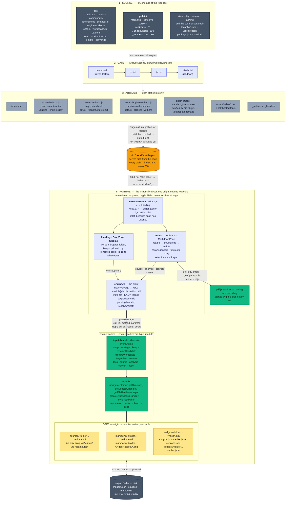
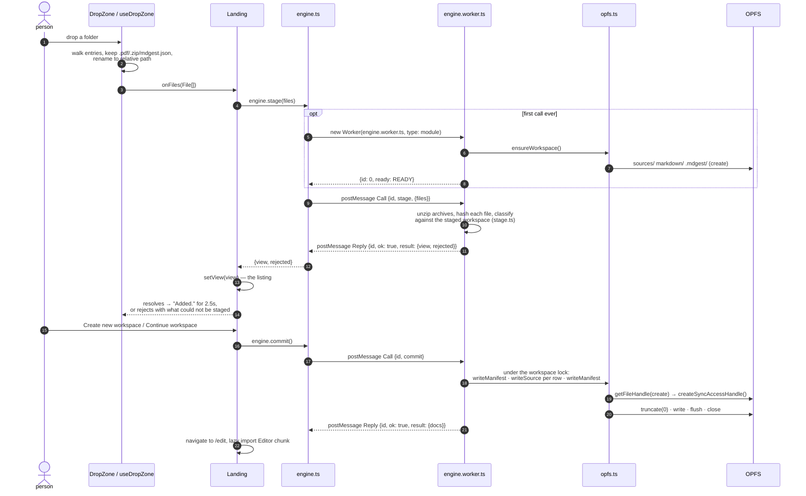
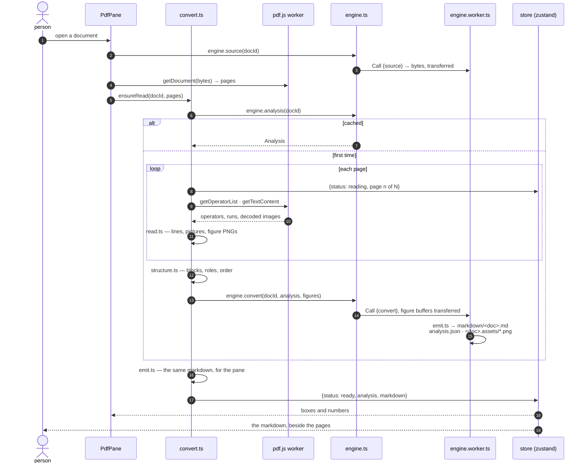

# Deployment

How the app gets from a commit to a visitor's browser, and where everything
runs once it is there. There is no server: the build is static files, and every
boundary the app has is inside one tab.

```mermaid
flowchart TB
    subgraph REPO ["1 &nbsp; SOURCE &nbsp;&mdash;&nbsp; git, one app at the repo root"]
        direction TB
        SRC["<b>src/</b><br/>main.tsx &middot; routes/ &middot; components/<br/>lib/ engine.ts &middot; protocol.ts &middot; engine.worker.ts<br/>opfs.ts &middot; workspace.ts &middot; stage.ts<br/>read.ts &middot; structure.ts &middot; emit.ts &middot; convert.ts"]
        PUB["<b>public/</b><br/>mark.svg &middot; icons.svg &middot; cursors/<br/><b>_redirects</b> &nbsp; <code>/* /index.html 200</code><br/><b>_headers</b> &nbsp; the CSP"]
        CFG["vite.config.ts &mdash; react, tailwind,<br/>and the pdf.js asset plugin<br/>tsconfig.*.json &middot; .oxlintrc.json<br/>package.json &middot; bun.lock"]
    end

    subgraph CI ["2 &nbsp; GATE &nbsp;&mdash;&nbsp; GitHub Actions, .github/workflows/ci.yml"]
        direction LR
        I["bun install<br/>--frozen-lockfile"] --> L["oxlint"] --> T["tsc -b"] --> B["vite build<br/>(rolldown)"]
    end

    subgraph DIST ["3 &nbsp; ARTIFACT &nbsp;&mdash;&nbsp; dist/, static files only"]
        direction TB
        HTML["index.html"]
        MAIN["assets/index-*.js<br/>react &middot; react-router<br/>Landing &middot; engine client"]
        EDIT["assets/Editor-*.js<br/>lazy route chunk<br/>pdf.js &middot; read/structure/emit"]
        WORK["assets/engine.worker-*.js<br/>module worker chunk<br/>opfs.ts &middot; stage.ts live here"]
        PJS["pdfjs/ cmaps &middot; standard_fonts &middot; wasm<br/><i>emitted by the plugin, fetched on demand</i>"]
        CSS["assets/index-*.css<br/>+ self-hosted fonts"]
        RED["_redirects &middot; _headers"]
    end

    CF[("4 &nbsp; <b>Cloudflare Pages</b><br/>serves dist/ from the edge<br/>every path &rarr; index.html, status 200")]

    subgraph BROWSER ["5 &nbsp; RUNTIME &nbsp;&mdash;&nbsp; the visitor's browser, one origin, nothing leaves it"]
        direction TB
        subgraph MAINT ["main thread &mdash; paints, reads PDFs, never touches storage"]
            direction TB
            RT["<b>BrowserRouter</b> &nbsp;<i>index-*.js</i><br/><code>/</code> &rarr; Landing<br/><code>/edit/*</code> &rarr; Editor, <i>Editor-*.js</i> on first visit<br/>splat, because an id has slashes"]
            LAND["<b>Landing &middot; DropZone &middot; Staging</b><br/>walks a dropped folder, keeps .pdf and .zip,<br/>renames each File to its relative path"]
            ED["<b>Editor</b> &mdash; PdfPane &middot; MarkdownPane<br/>read.ts &rarr; structure.ts &rarr; emit.ts<br/>canvas renders &middot; figures to PNG<br/>selection &middot; scroll sync"]
            ENG["<b>engine.ts</b> &mdash; the client<br/>new Worker(&hellip;, {type: module}) lazily, on first call<br/>waits for READY, then id-sequenced calls<br/>pending Map&lt;id, resolve/reject&gt;"]
            RT --> LAND
            RT --> ED
            LAND -->|"onFiles(File[])"| ENG
            ED -->|"source &middot; analysis &middot; convert &middot; asset"| ENG
        end

        PW["<b>pdf.js worker</b> &mdash; parsing and decoding<br/>started by pdfjs-dist, not by us"]
        ED <-->|"getTextContent &middot; getOperatorList<br/>render &middot; objs"| PW

        subgraph WT ["engine worker &mdash; engine.worker-*.js, type: module"]
            direction TB
            DISP["<b>dispatch table</b> exhaustive over Engine<br/>stage &middot; unstage &middot; keep &middot; renameCandidate<br/>discardWorkspace &middot; stageView &middot; commit<br/>docs &middot; source &middot; analysis &middot; convert &middot; asset"]
            OPFS["<b>opfs.ts</b><br/>navigator.storage.getDirectory()<br/>getDirectoryHandle / getFileHandle &mdash; async<br/>createSyncAccessHandle() &mdash; sync read/write<br/>truncate(0) &rarr; write &rarr; flush &rarr; close"]
            DISP --> OPFS
        end

        subgraph STORE ["OPFS &mdash; origin private file system, evictable"]
            direction TB
            S1["sources/&lt;folder&hellip;&gt;/&lt;doc&gt;.pdf<br/><i>the only thing that cannot be recomputed</i>"]
            S2["markdown/&lt;folder&hellip;&gt;/&lt;doc&gt;.md<br/>markdown/&lt;folder&hellip;&gt;/&lt;doc&gt;.assets/*.png"]
            S3[".mdgest/&lt;folder&hellip;&gt;/&lt;doc&gt;.pdf/<br/>analysis.json &middot; <b>edits.json</b> &middot; versions.json<br/>.mdgest/&lt;folder&hellip;&gt;/rules.json"]
        end

        ENG <==>|"postMessage<br/>Call {id, method, params}<br/>Reply {id, ok, result | error}"| DISP
        OPFS ==> STORE
    end

    EXPORT[("export folder on disk<br/>mdgest.json &middot; sources/ &middot; markdown/<br/><i>the only real durability</i>")]

    REPO -->|"push to main / pull request"| CI
    CI ==> DIST
    DIST -.->|"Pages git integration, or upload<br/>build: bun run build &middot; output: dist<br/><i>not wired in this repo yet</i>"| CF
    CF ==>|"GET / or /edit/&lt;doc&gt; &rarr; index.html<br/>&rarr; assets/index-*.js"| RT
    STORE <-.->|"export / restore &mdash; planned"| EXPORT

    classDef source fill:#475569,stroke:#334155,stroke-width:2px,color:#f8fafc
    classDef step fill:#e0e7ff,stroke:#6366f1,stroke-width:1px,color:#1e1b4b
    classDef file fill:#94a3b8,stroke:#64748b,stroke-width:1px,color:#0f172a
    classDef edge fill:#f59e0b,stroke:#b45309,stroke-width:2px,color:#1c1917
    classDef worker fill:#10b981,stroke:#047857,stroke-width:2px,color:#052e16
    classDef store fill:#fde68a,stroke:#b45309,stroke-width:1px,color:#1c1917

    class SRC,PUB,CFG source
    class I,L,T,B step
    class HTML,MAIN,EDIT,WORK,PJS,CSS,RED file
    class CF edge
    class RT,LAND,ED,ENG step
    class DISP,OPFS,PW worker
    class S1,S2,S3 store
    class EXPORT source
```

## What the boundaries are

**Build to edge.** The workflow is a gate, not a deploy: it lints, typechecks
and builds on every push to `main` and every pull request, and stops there.
Cloudflare Pages is expected to build the same way from the repo, with
`bun run build` as the command and `dist` as the output directory. That
connection is configured on the Cloudflare side and is not in this repo.

**Edge to browser.** `dist/` is plain files. Two of them are hosting
configuration. `_redirects` answers a deep link like `/edit/manuals/valves`
with `index.html` and a 200 rather than a 404, which the router needs and the
dev server does on its own — so deleting it breaks nothing until it is
deployed. `_headers` carries the CSP, and nothing honors it in dev or preview
either, for the same reason and with the same trap; the file documents itself.

**Main thread to engine worker.** OPFS's synchronous access handle is not
exposed on the main thread, so everything that touches storage runs in
`engine.worker.ts`, and `protocol.ts` is the contract: a map of method to
`{params, result}` that both sides are typechecked against. Adding a method
without a handler fails `tsc -b`, and therefore fails the gate. Large payloads
cross by transfer, not copy — a document's bytes, and a figure's — so a
hundred-megabyte PDF is never held twice.

**Main thread to pdf.js worker.** The second boundary, and not ours: `pdfjs-dist`
starts its own worker to parse and decode. That is why reading a document runs
on the page's thread rather than in the engine worker — pdf.js has the document
open there, a canvas exists there to draw a figure into, and the expensive part
is already off-thread. `read.ts` does geometry on what comes back; the engine
worker never sees a PDF as anything but bytes.

**The pdf.js assets** — character maps, the standard fourteen fonts, and the
no-wasm fallback decoders — are files pdf.js fetches on demand rather than code
it bundles. A plugin in `vite.config.ts` copies them out of the package into
`dist/pdfjs/` and serves them in dev from memory, so there is one list of them
and it is not a `public/` copy anyone has to remember to refresh.

**Worker to OPFS.** Resolving a handle is async everywhere; only read and write
on an already-resolved sync handle are synchronous. Every write truncates first,
because a sync handle writes at an offset into whatever is already there, and
every handle is closed in a `finally`, because an open one holds an exclusive
lock that the next open would reject on. Web Locks keep two tabs from writing
one workspace at once.

**OPFS to disk.** Browser storage is evictable and there is no account, so an
export is what saving means. `persist` asks the browser not to evict, and a
`true` there is advisory. Export and restore are not built yet — see
[storage.md](storage.md).

## One drop, end to end

```mermaid
sequenceDiagram
    autonumber
    actor P as person
    participant DZ as DropZone / useDropZone
    participant LD as Landing
    participant EN as engine.ts
    participant WK as engine.worker.ts
    participant FS as opfs.ts
    participant O as OPFS

    P->>DZ: drop a folder
    DZ->>DZ: walk entries, keep .pdf/.zip/mdgest.json,<br/>rename to relative path
    DZ->>LD: onFiles(File[])
    LD->>EN: engine.stage(files)

    opt first call ever
        EN->>WK: new Worker(engine.worker.ts, type: module)
        WK->>FS: ensureWorkspace()
        FS->>O: sources/ markdown/ .mdgest/ (create)
        WK-->>EN: {id: 0, ready: READY}
    end

    EN->>WK: postMessage Call {id, stage, {files}}
    WK->>WK: unzip archives, hash each file, classify<br/>against the staged workspace (stage.ts)
    WK-->>EN: postMessage Reply {id, ok: true, result: {view, rejected}}
    EN-->>LD: {view, rejected}
    LD->>LD: setView(view) — the listing
    LD-->>DZ: resolves → "Added." for 2.5s,<br/>or rejects with what could not be staged
    P->>LD: Create new workspace / Continue workspace
    LD->>EN: engine.commit()
    EN->>WK: postMessage Call {id, commit}
    WK->>FS: under the workspace lock:<br/>writeManifest · writeSource per row · writeManifest
    FS->>O: getFileHandle(create) → createSyncAccessHandle()
    FS->>O: truncate(0) · write · flush · close
    WK-->>EN: postMessage Reply {id, ok: true, result: {docs}}
    LD->>LD: navigate to /edit, lazy import Editor chunk
```

## One conversion, end to end

```mermaid
sequenceDiagram
    autonumber
    actor P as person
    participant PP as PdfPane
    participant CV as convert.ts
    participant PJ as pdf.js worker
    participant EN as engine.ts
    participant WK as engine.worker.ts
    participant ST as store (zustand)

    P->>PP: open a document
    PP->>EN: engine.source(docId)
    EN->>WK: Call {source} → bytes, transferred
    PP->>PJ: getDocument(bytes) → pages
    PP->>CV: ensureRead(docId, pages)
    CV->>EN: engine.analysis(docId)
    alt cached
        EN-->>CV: Analysis
    else first time
        loop each page
            CV->>ST: {status: reading, page n of N}
            CV->>PJ: getOperatorList · getTextContent
            PJ-->>CV: operators, runs, decoded images
            CV->>CV: read.ts — lines, pictures, figure PNGs
        end
        CV->>CV: structure.ts — blocks, roles, order
        CV->>EN: engine.convert(docId, analysis, figures)
        EN->>WK: Call {convert}, figure buffers transferred
        WK->>WK: emit.ts → markdown/<doc>.md<br/>analysis.json · <doc>.assets/*.png
    end
    CV->>CV: emit.ts — the same markdown, for the pane
    CV->>ST: {status: ready, analysis, markdown}
    ST-->>PP: boxes and numbers
    ST-->>P: the markdown, beside the pages
```

`emit.ts` runs on both sides of that boundary and is pure, which is the point:
the file in the workspace and the text on screen come from one function over
one analysis, so they cannot drift.

## Browser floor

| Requirement                      | Chrome / Edge | Firefox | Safari   |
| -------------------------------- | ------------- | ------- | -------- |
| OPFS with sync access handle     | **102**       | 111     | 15.2     |
| module worker (`type: "module"`) | 80            | **114** | 15       |
| Web Locks (`navigator.locks`)    | 69            | 96      | **15.4** |

The floor is the highest number in each column: the sync access handle sets
Chrome's (`getDirectory` alone is 86, the handle is not), the module worker
sets Firefox's, and Web Locks, which keep two tabs from writing one workspace
at once, set Safari's. Dropping to a classic worker would need a bundled script
and would lower Firefox to 111.

These are the storage APIs the workspace is built on. `pdfjs-dist` 6 declares
no browser floor of its own — only a Node one, for its build — so this table is
the app's, and it is worth re-measuring on a browser near the bottom of it
rather than trusting that the reader comes along for free. `OffscreenCanvas` is
not used: figures are drawn on the main thread, into an ordinary canvas.

## What to check after changing the CSP

`_headers` is enforced only on the deployed site, so the check is: deploy,
open a document, and read the console for "Refused to …". The two things most
likely to trip it are figures and the worker. Figures are shown from
`URL.createObjectURL`, which is a `blob:` URL, so `img-src` has to allow
`blob:`; the engine worker is a same-origin file rather than a blob, so
`worker-src 'self'` is enough. Neither is a reason to relax `object-src`,
`frame-src` or `base-uri`, which stay at `'none'` so that a PDF reaching an
`<embed>` fails loudly rather than quietly.
