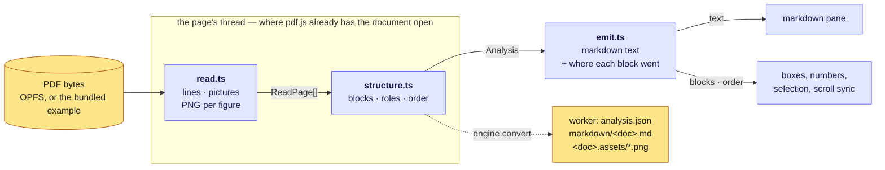

# How a page becomes markdown

Three files, one direction, no model:

`read.ts` and `structure.ts` run on the page's thread, because that is where
pdf.js has the document open and where a canvas exists to draw a figure into.
`emit.ts` is pure and runs on both sides: the worker calls it to write
`markdown/<doc>.md`, and the page calls it to know which source lines a block
became — so the numbered boxes on a page and the numbered lines beside them are
one list by construction, not two lists kept in step.

`convert.ts` is the conductor: one reading per document at a time, the engine's
cached `analysis.json` used when there is one, and the result put in the store
for both panes.

**The frame.** Everything downstream of `read.ts` is in PDF points, in each
page's own frame at scale 1, origin top-left, y down — what
`getViewport({ scale: 1 })` lays out, with the page's rotation already applied.
A box in an analysis is where a person sees the thing, which is what lets the
page pane draw it by multiplying by the zoom and nothing else.

---

## 1 — Reading the page

### Text

pdf.js hands over runs: a string in one font on one line, or a piece of one. A
run is not a line and not a word, so the line has to be rebuilt.

1. **Boxes.** A run's box is where its ink is, not the font's ascent and
   descent. Those bound every glyph the face has, so each line's box would
   reach the next one's and the leading between them — the gap every step
   below and all of structure tells lines, paragraphs and bands apart by —
   would be gone. The characters say most of what the ink would: up to cap
   height (`0.7 ×` the size) when the run has a capital, digit or ascender,
   only to x-height (`0.5 ×`) when it has none, and down to `0.22 ×` below the
   baseline only for a descender. A face of pictures — Wingdings, Symbol,
   Dingbats — or a run with no letters is given half its em box, centered.
   These are the fractions `spike/tauri` measured against pdfium's ink boxes,
   which the thresholds in structure were tuned on.
2. **Baselines.** Runs whose vertical middles fall inside one another's span,
   with at least half a run's height in the overlap, share a baseline. That is
   checked both ways round: a superscript sorts first, being higher, and the
   line under it has to be able to join it.
3. **Columns.** Within a band, runs are taken left to right and cut where the
   horizontal gap is wider than `0.6 ×` the taller run's height — except behind
   a list marker, where the gap is allowed to be `3 ×` as wide, because the
   space after a bullet is a wide one and a bullet is not a column of its own.
   A bullet drawn in Wingdings or Webdings comes out of pdf.js as its code in
   whatever form — `§`, `¡`, a control character, a private-use one — so a
   run of one glyph in those faces is read as `•`, as is `U+F0B7`, where Word
   maps the Symbol face's bullet. That is what lets it join its words and be a
   list item; left as it came, it stood apart as its own line, or a heading
   when set larger than the text.
4. **Spaces.** Between two runs of one line, a gap over `0.15 ×` the height is a
   space; anything smaller is kerning. A space pdf.js put in the string itself
   is kept too: the run's width already covers it, so no gap shows it, and
   `STAR® is` would otherwise come out `STAR®is`.
5. **Style.** A line's size, weight and slant are its majority *by character*,
   not by run: one italic word does not make an italic line. The font is the
   PDF's own name with the subset prefix stripped, so `ABCDEF+Helvetica-Bold`
   is `Helvetica-Bold`. Weight and slant come from that name, spelled out or
   cut short (`-Bd`, `-It`, as in `HelveticaNeueLTW1G-BdIt`).

### Pictures

A page's operator list is walked with the transform pdf.js's own canvas would
have at each step — `save`/`restore`, `transform`, form XObjects and
transparency groups all tracked — so every painted image is caught with the
matrix it was drawn under. That is what gives a picture its box on the page,
rather than its intrinsic size.

Not every painted image is a figure:

| threshold | value | what it excludes |
| --- | --- | --- |
| `MIN_PICTURE_PT` | 4 pt each way | hairline rules, bullet glyphs drawn as bitmaps |
| `MIN_PICTURE_PX` | 64 px each way | stretched one-pixel shims and gradients… |
| `BIG_ENOUGH_PT` | 24 pt each way | …unless drawn this large, where a few pixels blown up really is the picture |

What survives is drawn through its own transform into a canvas, so a rotated or
mirrored picture comes out the way it is seen, and written as a PNG at at least
`2` pixels per point and at most `4096` per side. A picture that cannot be
decoded falls back to rendering the page region under its box. Every surviving
picture is written and has a line in the markdown — there is no such thing as a
figure in the analysis that is not in the output.

Pictures are read before text on purpose: walking the operator list is what
loads the page's fonts, which the text's styles are then read from.

**Annotations are disabled** at read time (`AnnotationMode.DISABLE`). That keeps
form widgets and stamps out of the geometry, and it is also why a hyperlink
arrives as its visible text and nothing more.

---

## 2 — Structure: blocks, roles, order

Pure functions over what `read.ts` produced. The structure is read off the page
the way a person reads it in a second: what is larger or bolder is a heading,
what sits behind a bullet is an item, what sits further right is nested deeper,
what shares a column is read down before across.

**The body size** is the size most *characters* are set in, to a tenth of a
point — characters, not lines, so a document with fifty short headings and ten
long paragraphs still has the paragraph's size as its body.

**Whether bold means anything** is decided document-wide before anything else:
if more than 35% of the text is bold, bold is the body face and stops being
evidence of a heading. Under that, a bold line at body size that does not end in
`.`, `,` or `;` reads as a heading, as does any line at `1.1 ×` body or larger.
A line over 90 characters is prose however it is set.

**Reading order is an XY-cut.** Recursively: cut on vertical gutters first, then
on horizontal bands, until neither exists. Columns win over bands, because two
paragraph breaks that happen to line up across two columns are not a reason to
read across. A gutter has to be at least `0.6 ×` the page's median line height
and at least 3 points.

**Lines become blocks** by walking that order and asking whether each line
continues the one before it: close enough vertically (within `1.1 ×` line
height), overlapping horizontally, the same size and weight, and not starting
with a list marker. A wrapped paragraph may hang-indent, so a continuation is
allowed to start right of the first line's left edge but not meaningfully left
of it. Two heading lines in a row wrap into one heading.

**List markers** are matched off the front of a block's first line —
`•`-family glyphs, `-`/`–`/`—`/`·`/`*` followed by a space, `1.`, `(a)`, `iv)` —
and the marker is taken off the text and kept in `marker`. The dash and star
forms need the space: `-5 °C` and `*emphasis*` start lines too.

**Depth** comes from indentation, clustered within a column: the distinct left
edges of that column's list items, anything within 3 points folded together, and
an item's depth is how many of them sit to its left. A plain line indented under
an item, in the same column, no bolder and no larger and close below, is that
item's detail and becomes a nested bullet.

**Heading levels** are assigned document-wide from size alone: larger type is a
higher level, sizes within 8% of each other are one level (a 24pt and a 25pt
title are the same thing), and nothing goes deeper than `####` by default.

**Pictures are placed** among the text rather than appended: before the text
nearest to it — its label to the right on the same row, or its caption below it
— and at the end of the page when there is neither.

---

## 3 — Emitting

One pass per page, in block order:

- a heading is `#` × its level, with a blank line either side
- a list item is two spaces per depth, then the marker. The markers are
  **counted, not copied**: a paragraph resets the numbering, and coming back up
  a level resets the deeper ones, so a list that restarts at `1.` on a new page
  restarts in the markdown too
- a picture is ``
- bold and italic are applied to the whole block when every line of it carried
  them
- `---` between pages

What comes back is not only text. `Markdown` also carries, per block, the page
it was on, its number on that page, and the source line range it became — plus
`order`, every block written in document order. That is the whole basis of the
editor's selection: the note on a box, the line highlighted in the raw view, the
range a `shift`-click covers, and the pairs of positions that drive scroll sync.

---

## Where fidelity is still missing

Everything above is a *default*, and every default is a guess a person should be
able to overrule. That is `edits.json`, and it is the next thing to build; the
analysis regenerates from the PDF, and the markdown regenerates from the
analysis and the edits.

Beyond that, what a conversion cannot yet get right:

| gap | what comes out today | what it would take |
| --- | --- | --- |
| **tables** | the cells as separate blocks, in XY-cut order — usually one paragraph per cell | a ruling/alignment pass over a band: detect the grid from line boxes and drawn rules, then emit a GFM table. `remark-gfm` already renders them |
| **math** | the glyphs as printed, so a fraction comes out as its numerator and denominator on two lines | recognizing math runs by font (the `CM`/`STIX`/`MS` families) and layout, then emitting `$…$`. This is the hardest one |
| **hyperlinks** | the visible text, with the target lost | read link annotations separately from the operator list and attach each to the block whose box it covers |
| **headers and footers** | every running head and page number, on every page | the text-rule side of `rules.json`: a line repeated across pages at the same position, matched with digits wildcarded so page numbers do not break it |
| **hyphenation** | a word broken across two lines stays broken | joining `-` at a line end when the next line continues lowercase — safe in prose, wrong in code and in compound terms, so it wants to be an edit, not a default |
| **rotate** | the page's own rotation is applied; a block cannot be turned | a per-block override in the edits, and a reading pass over sideways text |
| **reading order across pages** | each page is cut on its own, so a paragraph spanning a page break is two blocks | a join edit, and later a rule for continuation |

Each of these is a fidelity feature, not a rewrite: they add roles and
attributes to `Block`, and lines to `emit.ts`. The frame, the ids and the cache
do not move.
